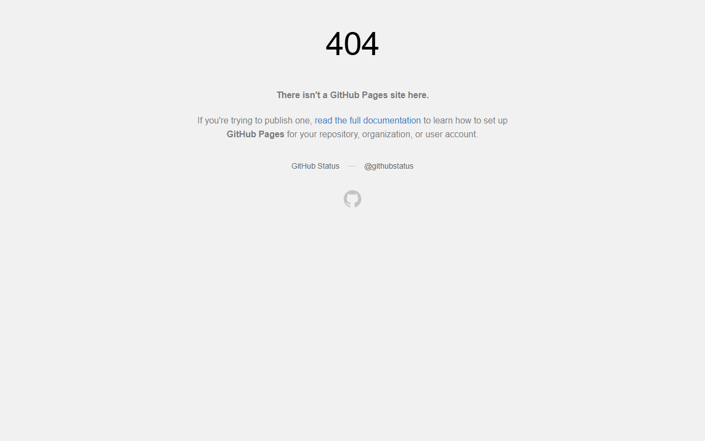

# CalcVerse — Scientific Calculator Web Application

[](https://mizan989.github.io/CalcVerse-Scientific_Calculator/)
[](https://react.dev/)
[](https://tailwindcss.com/)
[](https://mathjs.org/)

An advanced, responsive scientific calculator web application built with React, Tailwind CSS, and mathjs. CalcVerse combines robust mathematical precision with an intuitive, keyboard-accessible interface and dynamic visual themes.

---

## Live Demo

Experience the live application hosted on GitHub Pages:
**[https://mizan989.github.io/CalcVerse-Scientific_Calculator/](https://mizan989.github.io/CalcVerse-Scientific_Calculator/)**

---

## UI Preview



---

## Key Features

- **Comprehensive Mathematical Engine:** Standard arithmetic, trigonometry (sine, cosine, tangent and inverse functions), logarithms, powers, factorials, roots, and modulo.
- **Angle Mode Switching:** Seamless toggle between Degree (DEG) and Radian (RAD) calculation modes.
- **Calculation History & Memory:** Persistent calculation ledger with recallable past results and memory register operations (M+, M-, MR, MC).
- **Multiple Visual Themes:** Dark, Light, and Cyberpunk themes tailored for clarity and low eye strain.
- **Full Keyboard Accessibility:** Complete numeric keypad and operation hotkey bindings for rapid input.

---

## Tech Stack

- **Framework:** React 18 (Vite)
- **Mathematical Evaluation:** mathjs
- **Styling:** Tailwind CSS
- **Deployment:** GitHub Pages

---

## Getting Started

```bash
# Clone the repository
git clone https://github.com/mizan989/CalcVerse-Scientific_Calculator.git
cd CalcVerse-Scientific_Calculator

# Install dependencies
npm install

# Run the development server
npm run dev
```
Open [http://localhost:5173](http://localhost:5173) to view the calculator.
