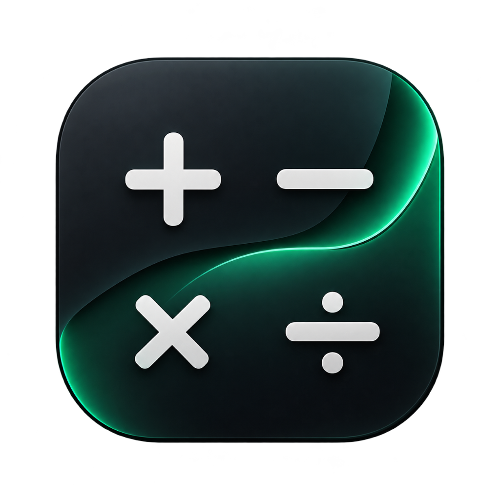
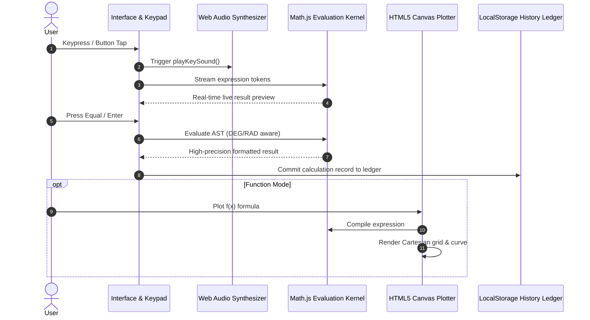

<p align="center">
  <a href="https://github.com/mizan989/CalcVerse-Scientific_Calculator">
    
  </a>
</p>

<div align="center">

# CalcVerse

### A distinctive, precision mathematical studio and scientific calculator. High-precision computation powered by mathjs, real-time Cartesian function graphing, multi-domain dimensional unit conversion, and tactile mechanical feedback — built exclusively in Obsidian.

<br/>

<a href="#-quick-start"></a>
<a href="https://mizan989.github.io/CalcVerse-Scientific_Calculator/"></a>
<a href="https://github.com/mizan989/CalcVerse-Scientific_Calculator/discussions"></a>

<a href="#-ways-to-run-calcverse"></a>
<a href="https://mizan989.github.io/CalcVerse-Scientific_Calculator/"></a>

<a href="https://github.com/mizan989/CalcVerse-Scientific_Calculator/stargazers"></a>
<a href="LICENSE"></a>
<a href="https://react.dev"></a>
<a href="https://vitejs.dev"></a>
<a href="https://tailwindcss.com"></a>
<a href="https://mathjs.org"></a>

</div>

> [!TIP]
> **Zero-Setup Live Web Application Ready!** Experience CalcVerse directly in your browser with instant calculations, real-time function graphing, and mechanical switch audio feedback live at **[mizan989.github.io/CalcVerse-Scientific_Calculator](https://mizan989.github.io/CalcVerse-Scientific_Calculator/)** — [Get started locally in under 60 seconds](#-quick-start).

---

## CalcVerse Overview

**CalcVerse** is a high-performance, open-source scientific calculator and interactive mathematical workstation built for the modern web. Designed as a physical instrument rather than a generic utility, CalcVerse pairs the mathematical rigor of **mathjs 15** with an uncompromising, distraction-free **Obsidian** identity.

From advanced trigonometry, roots, powers, and logarithms to real-time Cartesian function plotting, dimensional unit conversion, and persistent calculation logs, CalcVerse offers desktop-grade computational capability with fluid responsive ergonomics.

### Key Capabilities

- **High-Precision Mathematical Engine** — Advanced expression evaluation powered by mathjs, supporting arithmetic, exponents, logarithms, factorials, roots, modulo, reciprocal, and arbitrary precision.
- **Three Dedicated Calculation Modes** —
  - 🔬 **Scientific Mode** — Complete scientific cockpit with trigonometry, powers ($x^2, x^3, x^y$), roots ($\sqrt{x}, \sqrt[3]{x}$), constants ($\pi, e$), and utilities ($|x|, 1/x, \text{floor}, \text{ceil}, \text{mod}$).
  - 🔢 **Standard Mode** — Clean 4-column arithmetic layout optimized for rapid four-function computation.
  - 💻 **Programmer Mode** — Bitwise logical operations (`AND`, `OR`, `XOR`, `NOT`, `mod`, `<<`, `>>`) and instant radix conversion (`HEX`, `BIN`, `OCT`).
- **Trigonometric & Angular Precision** — Instant toggle between Degree (`DEG`) and Radian (`RAD`) angular modes, with 2nd-function inverse toggling (`sin⁻¹`, `cos⁻¹`, `tan⁻¹`, `10ˣ`, `eˣ`).
- **Real-Time Live Preview** — Non-blocking background evaluation engine providing real-time result preview as you type before committing with `=`.
- **Dynamic 2D Function Plotter** — Canvas-accelerated Cartesian grapher with mathematical gridlines, coordinate indicators, dynamic zoom controls, function presets, and a **"To Calc"** shortcut to transfer formulas into the calculator.
- **Dimensional Unit Converter** — Instant bi-directional conversion matrix covering Length, Mass & Weight, Temperature, Digital Data, Speed, and Time, with output copy and direct calculator transfer.
- **Persistent Calculation Ledger & Memory** — LocalStorage-backed calculation ledger with search filtering, formatted timestamps, one-click expression restoration, entry deletion, and text log export (`.txt`). Complete memory register suite (`MC`, `MR`, `MS`, `M+`, `M−`).
- **Web Audio Mechanical Clicks** — Synthesized mechanical switch audio pulses via the Web Audio API with instant mute/unmute control (`M`).
- **Offline & Self-Hosted Typography** — Zero external font CDNs or internet tracking. High-performance local WOFF2 font stack including **Geist**, **Geist Mono**, **Inter**, **JetBrains Mono**, and **Plus Jakarta Sans**.
- **Intentional Responsiveness** — Rigorously tested and optimized across 9 viewport classes, from compact 320px mobile screens to large desktop monitors.

---

## UI Preview

<p align="center">
  
</p>

---

## Computational Sequence Flow


```mermaid
sequenceDiagram
    autonumber
    actor User
    participant UI as Interface & Keypad
    participant Audio as Web Audio Synthesizer
    participant Engine as Math.js Evaluation Kernel
    participant Grapher as HTML5 Canvas Plotter
    participant Storage as LocalStorage History Ledger

    User->>UI: Keypress / Button Tap
    UI->>Audio: Trigger playKeySound()
    UI->>Engine: Stream expression tokens
    Engine-->>UI: Real-time live result preview
    User->>UI: Press Equal / Enter
    UI->>Engine: Evaluate AST (DEG/RAD aware)
    Engine-->>UI: High-precision formatted result
    UI->>Storage: Commit calculation record to ledger
    opt Function Mode
        User->>Grapher: Plot f(x) formula
        Grapher->>Engine: Compile expression
        Grapher->>Grapher: Render Cartesian grid & curve
    end
```

---

## 🚀 Quick Start

**Prerequisites:**
- Node.js 18+ (tested on Node.js v20, v22, and v24)
- npm, pnpm, or yarn

### Installation & First Run

```bash
# 1. Clone the repository
git clone https://github.com/mizan989/CalcVerse-Scientific_Calculator.git
cd CalcVerse-Scientific_Calculator

# 2. Install dependencies
npm install

# 3. Start the development server
npm run dev
```

Open **[http://localhost:5173](http://localhost:5173)** in your browser to start calculating.

> [!NOTE]
> CalcVerse runs entirely client-side with zero external network dependencies, trackers, or API keys required. All calculation logs and preferences are saved in your browser's `localStorage`.

---

## ☁️ Workspaces & Specialized Modules

CalcVerse provides three integrated tools accessible via the top studio navigation:

- **Calculator Studio (`calc`)** — Primary calculation cockpit with multi-tier display, caret tracking, live preview footnote, status badges (`DEG` / `RAD`, `INV`, `M`), and memory registers (`MC`, `MR`, `MS`, `M+`, `M−`). Embedded alongside the Calculation Ledger on desktop.
- **Cartesian Function Plotter (`plotter`)** — Canvas-accelerated 2D graphing workspace. Plot arbitrary mathematical functions $f(x)$, dynamically adjust zoom levels, and explore presets (`sin(x)`, `cos(x)`, `x²`, `x³ - 3x`, `1/x`, `e^(-x²)`, `tan(x)`, `|x|`).
- **Dimensional Unit Converter (`converter`)** — Comprehensive conversion engine across 6 physical and digital measurement systems with unit swapping and direct transfer into the calculation display.
- **Calculation Ledger Notebook** — Side-by-side desktop ledger or mobile slide-over drawer recording expressions, results, and timestamps. Supports search filtering, entry restoration, copy, and file export.
- **Hardware Keyboard Shortcuts Modal (`?`)** — Quick reference cataloging all hardware keybindings for rapid keypad navigation without touching a mouse.

---

## ⌨️ Keyboard Shortcuts Reference

CalcVerse is engineered for full hardware keyboard accessibility:

| Key Binding | Action | Key Binding | Action |
| :--- | :--- | :--- | :--- |
| `0` – `9` | Input digits | `S` | Insert `sin(` |
| `+`, `-`, `*`, `/` | Basic arithmetic operators | `C` | Insert `cos(` |
| `Enter` or `=` | Evaluate expression | `T` | Insert `tan(` |
| `Backspace` | Delete last character | `L` | Insert $\log_{10}($ |
| `Esc` | Clear all (`AC`) | `N` | Insert natural log $\ln($ |
| `.` | Decimal point | `^` | Exponentiation ($x^y$) |
| `%` | Modulo / Percentage | `!` | Factorial ($n!$) |
| `(` and `)` | Parentheses grouping | `P` | Insert Pi constant ($\pi$) |
| `H` | Toggle History Ledger | `E` | Insert Euler's constant ($e$) |
| `M` | Toggle Key Sound Effects | `?` | Open Keyboard Shortcuts Modal |

---

## Multi-Domain Unit Conversion Matrix

| Category | Supported Units |
| :--- | :--- |
| **Length** | Meters (`m`), Kilometers (`km`), Centimeters (`cm`), Millimeters (`mm`), Miles (`mi`), Yards (`yd`), Feet (`ft`), Inches (`in`) |
| **Mass & Weight** | Kilograms (`kg`), Grams (`g`), Milligrams (`mg`), Pounds (`lb`), Ounces (`oz`), Metric Tonnes (`t`) |
| **Temperature** | Celsius (`°C`), Fahrenheit (`°F`), Kelvin (`K`) |
| **Digital Data** | Bytes (`B`), Kilobytes (`KB`), Megabytes (`MB`), Gigabytes (`GB`), Terabytes (`TB`), Petabytes (`PB`) |
| **Speed** | Meters/sec (`m/s`), Kilometers/hr (`km/h`), Miles/hr (`mph`), Knots (`kn`), Mach (at sea level) |
| **Time** | Milliseconds (`ms`), Seconds (`s`), Minutes (`min`), Hours (`hr`), Days, Weeks, Years |

---

## Modern Tech Stack

| Layer | Technologies |
| :--- | :--- |
| **Frontend Framework** | React 19, Vite 8 |
| **Styling & Design Tokens** | Tailwind CSS v4, Obsidian design tokens |
| **Math & Graphing Engine** | mathjs 15, HTML5 Canvas 2D API |
| **Interactivity & Motion** | Framer Motion, Canvas Confetti |
| **Iconography** | Lucide React |
| **Typography** | Self-hosted WOFF2 fonts (Geist, Geist Mono, Inter, JetBrains Mono, Plus Jakarta Sans) |
| **Audio Synthesis** | Web Audio API (Synthesized mechanical switch clicks) |
| **Persistence** | Browser LocalStorage (Calculation history & preferences) |
| **Deployment & Hosting** | GitHub Pages (`gh-pages`) |

---

## Architecture & Code Structure

```text
CalcVerse/
├── public/
│   ├── calcverse-logo.png     # Authentic visual identity logo & favicon
│   └── fonts/                 # Self-hosted WOFF2 fonts & local fonts.css
│
├── src/
│   ├── assets/
│   │   └── calcverse-logo.png # High-resolution brand logo asset
│   ├── components/
│   │   ├── CalculatorDisplay.jsx    # Display bezel, status badges, & live preview
│   │   ├── HistoryDrawer.jsx        # Calculation ledger (embedded & slide-over)
│   │   ├── KeyboardModal.jsx        # Hardware keyboard shortcuts dialog
│   │   ├── Keypad.jsx               # Scientific, Standard, & Programmer keypads
│   │   ├── PlotterSection.jsx       # Canvas 2D Cartesian function grapher
│   │   ├── UnitConverterSection.jsx # Multi-domain unit conversion matrix
│   │   └── ui/
│   │       └── TactileButton.jsx    # Tactile spring-animated keycap primitive
│   ├── constants/
│   │   └── themes.js                # Obsidian design token specifications
│   ├── utils/
│   │   └── audio.js                 # Web Audio API mechanical switch synthesizer
│   ├── CalcVerse.jsx                # Root application coordinator & workspace router
│   ├── App.jsx                      # Application wrapper
│   ├── main.jsx                     # React 19 DOM entrypoint
│   └── index.css                    # Tailwind CSS v4 imports, grid texture, & scrollbars
│
├── assets/
│   └── screenshot.png         # High-resolution application preview screenshot
├── package.json               # Project manifest & dependency configuration
├── vite.config.js             # Vite 8 bundler configuration with React plugin
└── eslint.config.js           # ESLint configuration
```

---

## ☁️ Deployment

Deploy CalcVerse directly to GitHub Pages or any static web host:

### GitHub Pages (Configured)

```bash
# Build production bundle and publish to gh-pages branch
npm run deploy
```

The application is deployed live at:
**[https://mizan989.github.io/CalcVerse-Scientific_Calculator/](https://mizan989.github.io/CalcVerse-Scientific_Calculator/)**

### Static Web Hosting (Vercel / Netlify / Cloudflare Pages)

```bash
# Build the production bundle
npm run build

# Preview locally
npm run preview
```

Deploy the resulting `dist/` directory to your hosting provider of choice.

---

## Verification & Quality Bar

```bash
# Run ESLint linting verification
npm run lint

# Build production bundle
npm run build

# Test preview server locally
npm run preview
```

---

## Contributing

We welcome contributions! Whether you're adding matrix algebra operations, expanding the unit conversion catalog, or refining keyboard accessibility:

1. Fork the repository
2. Create your feature branch (`git checkout -b feature/matrix-operations`)
3. Commit your changes (`git commit -m 'Add matrix determinant and inversion tools'`)
4. Push to the branch (`git push origin feature/matrix-operations`)
5. Open a [Pull Request](https://github.com/mizan989/CalcVerse-Scientific_Calculator/pulls)

---

## Support the Project

**Enjoying CalcVerse?** Give us a ⭐ on [GitHub](https://github.com/mizan989/CalcVerse-Scientific_Calculator) to help others discover modern mathematical tools!

---

## Acknowledgements

CalcVerse is crafted with gratitude towards the open-source community:

- [React 19](https://react.dev/) & [Vite](https://vitejs.dev/) — Next-generation frontend framework and lightning-fast tooling
- [mathjs](https://mathjs.org/) — Extensive mathematical library for JavaScript and Node.js
- [Tailwind CSS v4](https://tailwindcss.com/) — Next-generation utility-first styling engine
- [Lucide Icons](https://lucide.dev/) — Consistent, elegant UI iconography
- [Framer Motion](https://www.framer.com/motion/) — Fluid spring physics and micro-interactions
- [Canvas Confetti](https://github.com/catdad/canvas-confetti) — Celebration animations
