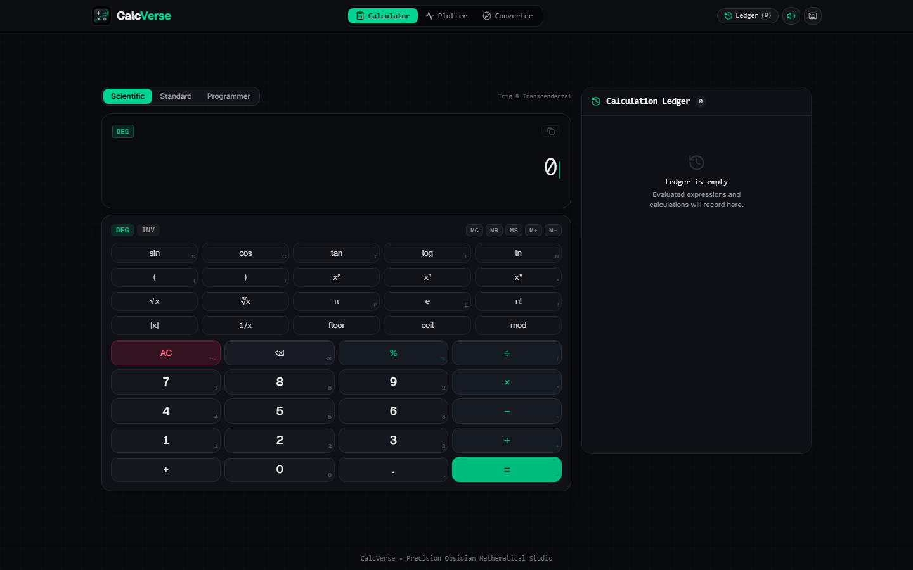
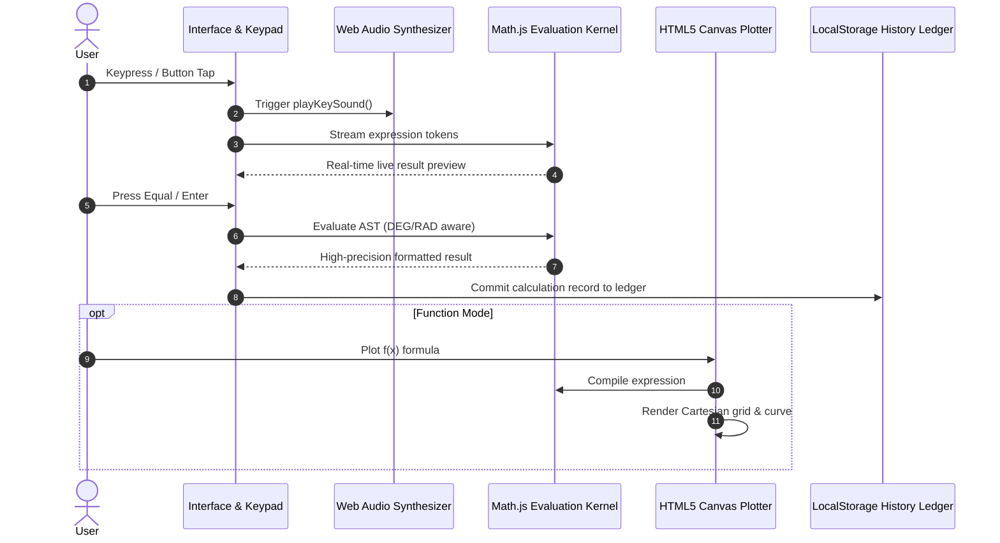

<p align="center">
  <a href="https://github.com/mizan989/CalcVerse-Scientific_Calculator">
    
  </a>
</p>

<div align="center">

# CalcVerse

### The modern, open-source scientific calculator & mathematical workstation. High-precision computation powered by mathjs, real-time function graphing, multi-domain unit conversion, and tactile audio-visual themes.

<br/>

<a href="#-quick-start"></a>
<a href="https://mizan989.github.io/CalcVerse-Scientific_Calculator/"></a>
<a href="https://github.com/mizan989/CalcVerse-Scientific_Calculator/discussions"></a>

<a href="#-ways-to-run-calcverse"></a>
<a href="https://mizan989.github.io/CalcVerse-Scientific_Calculator/"></a>

<a href="https://github.com/mizan989/CalcVerse-Scientific_Calculator/stargazers"></a>
<a href="LICENSE"></a>
<a href="https://react.dev"></a>
<a href="https://vitejs.dev"></a>
<a href="https://tailwindcss.com"></a>
<a href="https://mathjs.org"></a>

</div>

> [!TIP]
> **Zero-Setup Live Web Application Ready!** Experience CalcVerse directly in your browser with instant calculations, real-time function graphing, and mechanical switch audio feedback live at **[mizan989.github.io/CalcVerse-Scientific_Calculator](https://mizan989.github.io/CalcVerse-Scientific_Calculator/)** — [Get started locally in under 60 seconds](#-quick-start).

---

## CalcVerse Overview

CalcVerse is a high-performance, open-source scientific calculator and interactive mathematical workstation built for the modern web. Engineered to replace clunky, ad-bloated online calculators and dated desktop utilities, CalcVerse combines the rigorous mathematical precision of **mathjs 15** with an Apple and Linear-inspired tactile interface.

From complex trigonometry and logarithmic calculus to interactive Cartesian function plotting, multi-category physical unit conversion, and persistent calculation history, CalcVerse bridges high computational rigor with fluid, responsive design.

**Key Capabilities:**

- **High-Precision Mathematical Engine** — Advanced expression evaluation powered by mathjs, supporting arithmetic, exponents, logarithms, factorials, roots, modulo, and arbitrary precision
- **Trigonometric & Angular Precision** — Seamless toggle between Degree (DEG) and Radian (RAD) angular modes, complete with inverse functions (`asin`, `acos`, `atan`)
- **Real-Time Live Preview** — Non-blocking background evaluation engine providing real-time result preview as you type before committing with `=`
- **Dynamic 2D Function Plotter** — Canvas-accelerated Cartesian grapher with real-time expression compilation, dynamic zoom (`[-zoom, +zoom]`), and one-click mathematical presets
- **Multi-Domain Unit Converter** — Instant bi-directional conversion matrix covering Length, Mass & Weight, Temperature, Digital Storage, Speed, and Time
- **Persistent Calculation Ledger & Memory** — LocalStorage-backed calculation drawer with recallable expressions, granular record deletion, and memory registers (`M+`, `M-`, `MR`, `MC`)
- **Web Audio Mechanical Clicks** — Synthesized mechanical switch sound effects via Web Audio API with instant mute/unmute controls
- **Curated Tactile Design Themes** — Four bespoke themes (**Obsidian**, **Alabaster**, **Titanium**, **Bauhaus**) with spotlight cursor illumination, smooth Lenis momentum scrolling, and floating Inspira dock
- **Comprehensive Hardware Keybindings** — Full keyboard hotkey mapping for lightning-fast arithmetic and scientific operations

<br>

<div align="center">
  <pre>
┌─────────────────────────────────────────────────────────────────────────────────┐
│                                   CALCVERSE                                     │
│      Input Token ➔ MathJS AST ➔ Precision Kernel ➔ Live Preview ➔ Canvas        │
├───────────────────────────────┬─────────────────────────────────────────────────┤
│  🧮 Precision Math Kernel      │  📈 Canvas Function Plotter                     │
│   • Trigonometry (DEG / RAD)  │    [Plotter: f(x) = sin(x)]                     │
│   • Logarithms (ln, log₁₀)    │       ├── Real-time canvas coordinate mapping   │
│   • Memory registers (M+/MR)  │       └── Dynamic domain scaling & presets      │
├───────────────────────────────┼─────────────────────────────────────────────────┤
│  🔄 Multi-Domain Converter    │  🎨 Tactile Audio-Visual Studio                 │
│   • 6 Physical & Digital tiers│    • 4 curated themes (Obsidian, Bauhaus, etc.) │
│   • Instant bi-directional swap│    • Web Audio API synthesized switch clicks    │
└───────────────────────────────┴─────────────────────────────────────────────────┘
  </pre>
</div>

---

## UI Preview

<p align="center">
  
</p>

---

## Computational Sequence Flow


```mermaid
sequenceDiagram
    autonumber
    actor User
    participant UI as Interface & Keypad
    participant Audio as Web Audio Synthesizer
    participant Engine as Math.js Evaluation Kernel
    participant Grapher as HTML5 Canvas Plotter
    participant Storage as LocalStorage History Ledger

    User->>UI: Keypress / Button Tap
    UI->>Audio: Trigger playKeySound()
    UI->>Engine: Stream expression tokens
    Engine-->>UI: Real-time live result preview
    User->>UI: Press Equal / Enter
    UI->>Engine: Evaluate AST (DEG/RAD aware)
    Engine-->>UI: High-precision formatted result
    UI->>Storage: Commit calculation record to ledger
    opt Function Mode
        User->>Grapher: Plot f(x) formula
        Grapher->>Engine: Compile expression
        Grapher->>Grapher: Render Cartesian grid & curve
    end
```

---

## Use Cases

- **STEM & Academic Education** — Perform rigorous trigonometry, calculus, and scientific problem-solving with immediate graphical feedback
- **Engineering & Physics Calculations** — Evaluate complex formulas, exponential decay, inverse trigonometric functions, and arbitrary powers
- **Dimensional & Metric Conversion** — Convert measurements between metric, imperial, and digital storage units in real time
- **Function Visualization & Curve Analysis** — Plot polynomial, trigonometric, and exponential equations to inspect domain roots and behaviors
- **Rapid Daily & Professional Computing** — Utilize full keyboard accessibility and instant memory recall for continuous workflows

---

## 🚀 Quick Start

**Prerequisites:**
- Node.js 18+ (tested on Node.js v20, v22, and v24)
- npm, pnpm, or yarn

### Installation & First Run

```bash
# 1. Clone the repository
git clone https://github.com/mizan989/CalcVerse-Scientific_Calculator.git
cd CalcVerse-Scientific_Calculator

# 2. Install dependencies
npm install

# 3. Start the development server
npm run dev
```

Open **[http://localhost:5173](http://localhost:5173)** in your browser to start calculating.

> [!NOTE]
> CalcVerse runs entirely client-side with zero external network dependencies or API keys required. All calculation logs and theme preferences are saved safely in your browser's `localStorage`.

---

## Ways to Run CalcVerse

- **Live Web Application (GitHub Pages)** — Hosted live on GitHub Pages with zero installation required. [Try Live App](https://mizan989.github.io/CalcVerse-Scientific_Calculator/)
- **Local Development Server** — Run with instant hot-module replacement (HMR) using Vite 8 and React 19. [Quick Start](#-quick-start)
- **Static Production Bundle** — Compile optimized static assets (`npm run build`) and deploy to any hosting provider (GitHub Pages, Vercel, Netlify, Cloudflare Pages, Nginx).

---

## ☁️ Workspaces & Specialized Modules

CalcVerse provides a cohesive collection of mathematical tools accessible via the interactive Inspira floating dock:

- **Scientific Keypad Studio (`#calculator`)** — Primary calculation cockpit featuring multi-level displays, caret tracking, live preview, angle mode selectors (`DEG` / `RAD`), inverse toggle (`INV`), and memory registers (`M+`, `M-`, `MR`, `MC`).
- **Interactive Function Plotter (`#plotter`)** — Canvas-accelerated 2D Cartesian graphing workspace. Plot any arbitrary function $f(x)$, dynamically adjust domain zoom, and experiment with quick presets (`sin(x)`, `cos(x)`, `x²`, `x³ - 3x`, `1/x`, `e^(-x²)`).
- **Multi-Category Unit Converter (`#converter`)** — Comprehensive conversion engine across 6 major physical and digital measurement systems with one-click output copying and quick expression injection.
- **Persistent History Drawer** — Slide-out calculation archive logging mathematical expressions, computed results, and relative timestamps with one-click expression restoration.
- **Keyboard Shortcuts Reference Modal (`?`)** — Interactive overlay cataloging all hardware keybindings for rapid keypad navigation without touching a mouse.

---

## ✨ Features & Technical Highlights

### High-Precision Mathematical Evaluation

CalcVerse utilizes **mathjs 15** for expression parsing and evaluation. Trigonometric functions dynamically adapt based on the selected angular mode:

```javascript
// DEG vs RAD trigonometric adaptation
const toRad = (x) => (angleMode === 'DEG' ? (x * Math.PI) / 180 : x);
const toDeg = (x) => (angleMode === 'DEG' ? (x * 180) / Math.PI : x);

mathInstance.import({
  sin: (x) => Math.sin(toRad(x)),
  cos: (x) => Math.cos(toRad(x)),
  tan: (x) => Math.tan(toRad(x)),
  asin: (x) => toDeg(Math.asin(x)),
  acos: (x) => toDeg(Math.acos(x)),
  atan: (x) => toDeg(Math.atan(x)),
}, { override: true });
```

### Canvas-Accelerated Function Graphing

The function grapher compiles mathematical expressions into optimized evaluators and maps coordinate geometry to a high-DPI HTML5 Canvas:

- **Dynamic Domain Scaling** — Zoom in and out smoothly between `[-5, 5]` and `[-50, 50]` domain intervals.
- **Cartesian Grid & Axis Markings** — Dynamic subdivision grid lines with numerical domain labels adapting to theme contrast.
- **High-DPI Retina Support** — Automatically scales with `window.devicePixelRatio` for razor-sharp rendering on all screens.

### Multi-Domain Unit Conversion Matrix

| Category | Supported Units |
| :--- | :--- |
| **Length** | Meters (`m`), Kilometers (`km`), Centimeters (`cm`), Millimeters (`mm`), Miles (`mi`), Yards (`yd`), Feet (`ft`), Inches (`in`) |
| **Mass & Weight** | Kilograms (`kg`), Grams (`g`), Milligrams (`mg`), Pounds (`lb`), Ounces (`oz`), Metric Tonnes (`t`) |
| **Temperature** | Celsius (`°C`), Fahrenheit (`°F`), Kelvin (`K`) |
| **Digital Data** | Bytes (`B`), Kilobytes (`KB`), Megabytes (`MB`), Gigabytes (`GB`), Terabytes (`TB`), Petabytes (`PB`) |
| **Speed** | Meters/sec (`m/s`), Kilometers/hr (`km/h`), Miles/hr (`mph`), Knots (`kn`), Mach (at sea level) |
| **Time** | Milliseconds (`ms`), Seconds (`s`), Minutes (`min`), Hours (`hr`), Days, Weeks, Years |

### Tactile Audio & Visual System

- **Web Audio API Key Clicks** — Synthetic micro-burst audio pulses simulate real mechanical keyboard switches with zero external audio assets.
- **Bespoke Theme Engine** —
  - 🌑 **Obsidian** — Deep OLED black (`#090a0c`) with vibrant emerald accents (`#34d399`) and cyan spotlights
  - ⚪ **Alabaster** — Minimalist porcelain white (`#f7f8fa`) with cobalt blue accents (`#2563eb`)
  - 🪙 **Titanium** — Industrial graphite (`#131417`) with warm amber accents (`#f59e0b`)
  - 🎨 **Bauhaus** — Classic archival parchment (`#f4efe6`) with vibrant vermilion orange (`#ea580c`)
- **Inspira Floating Dock** — Mac-style magnification dock for seamless jumping between Calculator, Grapher, Converter, and History.

---

## ⌨️ Keyboard Shortcuts Reference

CalcVerse is engineered for full keyboard navigation:

| Key Binding | Action | Key Binding | Action |
| :--- | :--- | :--- | :--- |
| `0` – `9` | Input digits | `S` | Insert `sin(` |
| `+`, `-`, `*`, `/` | Basic arithmetic operators | `C` | Insert `cos(` |
| `Enter` or `=` | Evaluate expression | `T` | Insert `tan(` |
| `Backspace` | Delete last character | `L` | Insert `log10(` |
| `Esc` | Clear all (`AC`) | `N` | Insert natural log `ln(` |
| `.` | Decimal point | `^` | Exponentiation (`xʸ`) |
| `%` | Modulo / Percentage | `!` | Factorial (`n!`) |
| `(` and `)` | Parentheses grouping | `P` | Insert Pi constant (`π`) |
| `H` | Toggle History Drawer | `E` | Insert Euler's constant (`e`) |
| `M` | Toggle Key Sound Effects | `?` | Open Keyboard Shortcuts Modal |

---

## Modern Tech Stack

| Layer | Technologies |
| :--- | :--- |
| **Frontend Framework** | React 19, Vite 8 |
| **Styling & Design Tokens** | Tailwind CSS v4, Custom CSS Variables |
| **Math & Graphing Engine** | mathjs 15, HTML5 Canvas 2D API |
| **Interactivity & Motion** | Framer Motion, Lenis Smooth Scroll, Canvas Confetti |
| **Iconography** | Lucide React |
| **Audio Synthesis** | Web Audio API (Synthesized mechanical switch clicks) |
| **Persistence** | Browser LocalStorage (Calculation history & preferences) |
| **Deployment & Hosting** | GitHub Pages (`gh-pages`) |

---

## Architecture & Code Structure

```text
CalcVerse/
├── public/
│   ├── favicon.svg            # Vector calculator application logo & favicon
│   └── icons.svg              # SVG sprite assets
│
├── src/
│   ├── assets/                # Hero imagery and framework branding
│   ├── components/
│   │   ├── CalculatorDisplay.jsx   # Multi-tier expression & result viewport
│   │   ├── HistoryDrawer.jsx       # Slide-out calculation history ledger
│   │   ├── KeyboardModal.jsx       # Interactive keyboard shortcut dialog
│   │   ├── Keypad.jsx              # Tactile scientific keypad layout & controls
│   │   ├── PlotterSection.jsx      # Canvas-based 2D Cartesian function grapher
│   │   ├── UnitConverterSection.jsx # Multi-category physical & digital converter
│   │   └── ui/
│   │       ├── BentoCard.jsx       # Glassmorphic container with theme borders
│   │       ├── GridBackground.jsx  # Atmospheric background grid pattern
│   │       ├── InspiraDock.jsx     # Floating magnification dock navigation
│   │       ├── LenisProvider.jsx   # Smooth inertia scrolling container
│   │       ├── Spotlight.jsx       # Interactive radial spotlight lighting effect
│   │       └── TactileButton.jsx   # Spring-animated tactile button primitive
│   ├── constants/
│   │   └── themes.js          # Obsidian, Alabaster, Titanium, Bauhaus tokens
│   ├── hooks/
│   │   └── useLenis.js        # Smooth scrolling orchestration hook
│   ├── utils/
│   │   └── audio.js           # Web Audio API procedural mechanical click synthesizer
│   ├── CalcVerse.jsx          # Root calculation state coordinator & dock manager
│   ├── App.jsx                # Application wrapper
│   ├── main.jsx               # React 19 DOM entrypoint
│   └── index.css              # Tailwind CSS v4 imports & custom scrollbars
│
├── assets/
│   └── screenshot.png         # High-resolution application preview screenshot
├── package.json               # Project manifest & dependency configuration
└── vite.config.js             # Vite 8 bundler configuration with React plugin
```

---

## ☁️ Deployment

Deploy CalcVerse directly to GitHub Pages or any static web host:

### GitHub Pages (Configured)

```bash
# Build production bundle and publish to gh-pages branch
npm run deploy
```

The application is deployed live at:
**[https://mizan989.github.io/CalcVerse-Scientific_Calculator/](https://mizan989.github.io/CalcVerse-Scientific_Calculator/)**

### Static Web Hosting (Vercel / Netlify / Cloudflare Pages)

```bash
# Build the production bundle
npm run build

# Preview locally
npm run preview
```

Deploy the resulting `dist/` directory to your hosting provider of choice.

---

## Verification & Quality Bar

```bash
# Run ESLint linting verification
npm run lint

# Build production bundle
npm run build

# Test preview server locally
npm run preview
```

---

## Contributing

We welcome contributions! Whether you're adding matrix algebra operations, expanding the unit conversion catalog, or introducing new themes:

1. Fork the repository
2. Create your feature branch (`git checkout -b feature/matrix-operations`)
3. Commit your changes (`git commit -m 'Add matrix determinant and inversion tools'`)
4. Push to the branch (`git push origin feature/matrix-operations`)
5. Open a [Pull Request](https://github.com/mizan989/CalcVerse-Scientific_Calculator/pulls)

---

## Support the Project

**Enjoying CalcVerse?** Give us a ⭐ on [GitHub](https://github.com/mizan989/CalcVerse-Scientific_Calculator) to help others discover modern mathematical tools!

---

## Acknowledgements

CalcVerse is crafted with gratitude towards the open-source community:

- [React 19](https://react.dev/) & [Vite](https://vitejs.dev/) — Next-generation frontend framework and lightning-fast tooling
- [mathjs](https://mathjs.org/) — Extensive mathematical library for JavaScript and Node.js
- [Tailwind CSS v4](https://tailwindcss.com/) — Next-generation utility-first styling engine
- [Lucide Icons](https://lucide.dev/) — Consistent, elegant UI iconography
- [Framer Motion](https://www.framer.com/motion/) — Fluid spring physics and micro-interactions
- [Lenis](https://lenis.darkroom.engineering/) — Premium smooth scrolling momentum engine
- [Canvas Confetti](https://github.com/catdad/canvas-confetti) — Joyful celebration animations

<div align="center">

> [!NOTE]
> **Mathematical Precision & Float Representation:** CalcVerse leverages mathjs 15 for arbitrary precision and exact expression parsing. Scientific notation automatically activates beyond standard float thresholds (`1e15` or `< 1e-10`) to safeguard accuracy and prevent display overflow.

</div>
